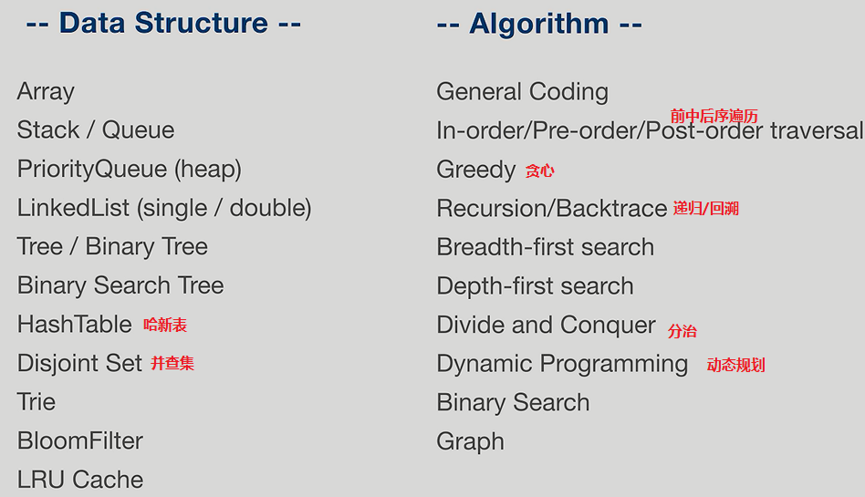
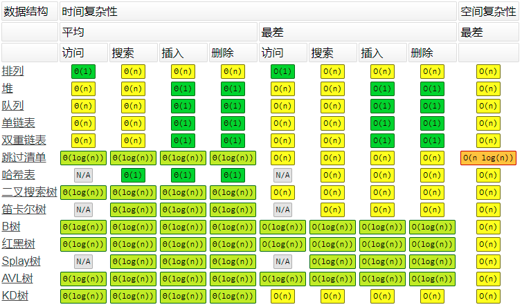
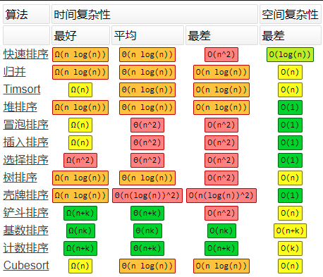

# 导学

白板编程网站：collabedit.com、coderpad.io

书籍推荐：异类-不一样的成功启示录

如何做到精通一个领域？
+ chunk it up 切碎知识点
+ deliberate practice 刻意练习
+ feedback 反馈

课程内容



切题四件套
+ clarification 弄清题意
+ possible solutions: compare(time/space) --> optimal solution
+ coding
+ test cases

时间/空间复杂度  
O(1) < O(logn) < O(n) < O(nlogn) < O(n^2) < O(n^3) < O(2^n) < O(n!)，其中几个代码如下：
```java
//O(logn)
for(int i=0;i<n;i=i*2) {
    System.out.println("hello world!");
}

//O(2^n)
for(int i=0;i<=Math.pow(2,n);i++) {
    System.out.println("hello world!");
}

//O(n!)
for(int i=0;i<=factorial(n);i++) {
    System.out.println("hello world!");
}
```

Fibonacci Array
+ 0 1 1 2 3 5 8 ...
+ n=0或n=1时，F(n)=0; n>=2时，F(n)=F(n-1)+F(n-2)
+ 代码如下：
  ```python
  def fib(n):
    if n==0 or n==1:
        return n
    return fib(n-1)+fib(n-2)
  ```
+ 时间复杂度：  
  上式可以转为数学上的二阶常系数齐次差分方程$y_{t+2}-y_{t+1}-y_t=0$，特征方程为：$x^2-x-1=0$
  
  解得$x=\frac{1\pm\sqrt{5}}{2}$，因此F(n)的通解为：$y=C_1(\frac{1+\sqrt{5}}{2})^n+C_2(\frac{1-\sqrt{5}}{2})^n$。
  
  由F(0)=0,F(1)=1,可以求得$C_1$、$C_2$。最终求得F(n)的通解为：$y=\frac{1}{\sqrt{5}}[(\frac{1+\sqrt{5}}{2})^n-(\frac{1-\sqrt{5}}{2})^n]$。
  
  最终求得时间复杂度为$O(2^n)$，因此说Fibonacci Array的代码这样写很差，自己思考最优解。

常见算法的时间复杂度
+ Binary search(二分搜索): $O(logn)$
+ Binary tree traveral(二叉树遍历): $O(n)$
+ Optimal Sorted Matrix Search(最优有序矩阵查找): $O(n)$
+ merge sort: $O(nlogn)$

通用数据结构操作的时间/空间复杂度



数组排序算法时间/空间复杂度



LeetCode  
https://leetcode.com/problemset/all/

Editor: VSCode、IntelliJ IDEA、Pycharm(Python)
